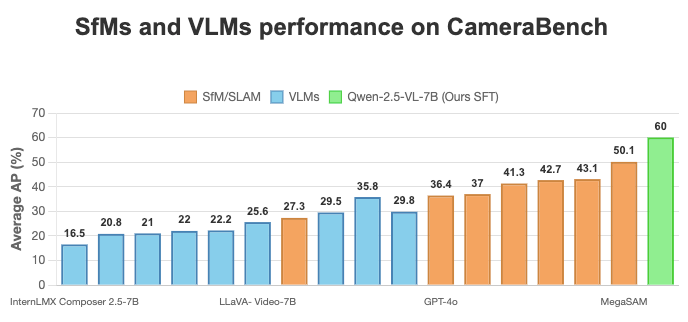
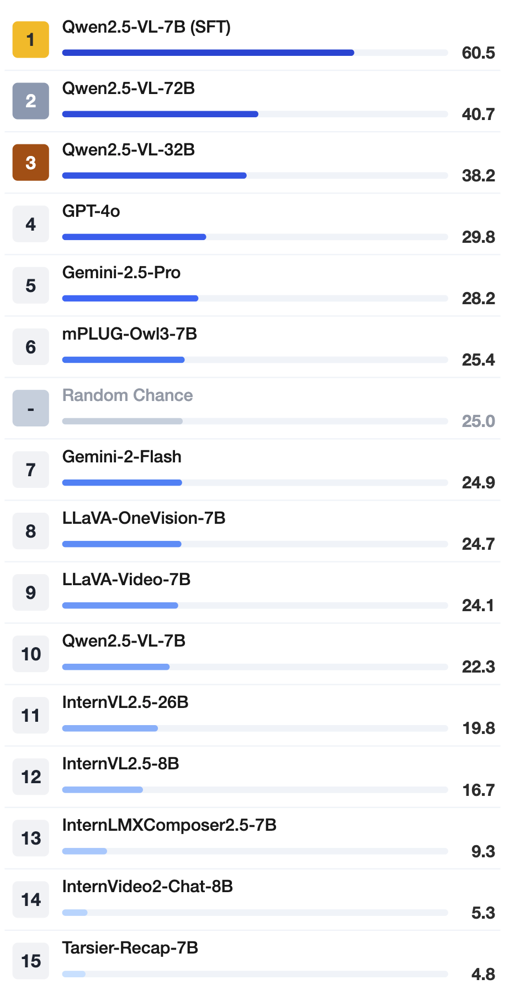

<p align="center">
  
</p>

## 📷 **CameraBench: Towards Understanding Camera Motions in Any Video**  

[](https://arxiv.org/abs/2504.15376)
[](https://linzhiqiu.github.io/papers/camerabench/)
[](https://huggingface.co/datasets/syCen/CameraBench)


> **SfMs and VLMs performance on CameraBench**: Generative VLMs (evaluated with [VQAScore](https://linzhiqiu.github.io/papers/vqascore/)) trail classical SfM/SLAM in pure geometry, yet they outperform discriminative VLMs that rely on CLIPScore/ITMScore and—even better—capture scene‑aware semantic cues missed by SfM
> After simple supervised fine‑tuning (SFT) on ≈1,400 extra annotated clips, our 7B Qwen2.5‑VL doubles its AP, outperforming the current best MegaSAM!

## 📰 News
- **[2025/09/18]🔥** CameraBench has been accepted as a **Spotlight** @ NeurIPS 2025.
- **[2025/09/15]🔥** We released the codebase for both **training** and **evaluation**.
- **[2025/05/20]🔥** We open-sourced our **fine-tuned 32B and 72B models**
- **[2025/04/28]🔥** CameraBench received over 150 likes on Hugging Face and ranked 1st among both the daily and weekly papers.
- **[2025/04/26]🔥** We open‑sourced our **fine‑tuned 7B model** and the public **test set**—1 000+ videos with expert labels & captions. Stay tuned for stronger models in the future!
- **LLMs‑eval** integration is in progress—stay tuned!
- 32B & 72B checkpoints are on the way.

## 🌍 Explore More
- [🤗**CameraBench Testset**](https://huggingface.co/datasets/syCen/CameraBench): Download the testset.
- 🚀**Fine-tuned Models** ([7B param](https://huggingface.co/chancharikm/qwen2.5-vl-7b-cam-motion-preview), [32B param](https://huggingface.co/chancharikm/qwen2.5-vl-32b-cam-motion-preview), [72B param](https://huggingface.co/chancharikm/qwen2.5-vl-72b-cam-motion-preview)): Access model checkpoints on HuggingFace!
- [🏠**Home Page**](https://linzhiqiu.github.io/papers/camerabench/): Demos & docs.
- [📖**Paper**](https://arxiv.org/abs/2504.15376): Detailed information about CameraBench.
- [📈**Leaderboard**](https://sy77777en.github.io/CameraBench/leaderboard/table.html): Explore the full leaderboard..

## ❓ How to Access / Evaluate on CameraBench
1. Evaluation Code:
   Use our official codebase for camera motion classification, VQA, and captioning tasks: <br>
   🔗[CameraBench Evaluation Code](https://github.com/linzhiqiu/t2v_metrics/tree/main/camerabench)
3. Training Dataset Access:
   To request access to the training dataset, please complete this form with all relevant details. Providing thorough information will help us process your request more efficiently and reduce unnecessary back-and-forth by email: <br>
   👉 [Dataset Request Form](https://forms.gle/26LB1rouSZsR29Cx9)

## 🔎 VQA evaluation on VLMs

<table>
  <tr>
    <td>
    <div style="display: flex; flex-direction: column; gap: 1em;">
      
     </div>
    </td>
    <td>
      <div style="display: flex; flex-direction: column; gap: 1em;">
        <div>        
          <br>
          🤔: Does the camera track the subject from a side view? <br>
          🤖: ✅  &nbsp;&nbsp;&nbsp;&nbsp;&nbsp;&nbsp; 🙋: ✅
        </div>
        <div>
          <br>
          🤔: Does the camera only move down during the video? <br>
          🤖: ❌  &nbsp;&nbsp;&nbsp;&nbsp;&nbsp;&nbsp; 🙋: ✅
        </div>
        <div>
          <br>
          🤔: Does the camera move backward while zooming in? <br>
          🤖: ❌  &nbsp;&nbsp;&nbsp;&nbsp;&nbsp;&nbsp; 🙋: ✅
        </div>
      </div>
    </td>
  </tr>
</table>

## 🚀 Quick Start

### Download test videos
```python
python download_test_videos.py --save_dir ./your_target_folder
```

### Get captions & labels (subset)
```python
python download_test_file.py --save_dir ./your_target_folder
```

### Use the finetuned model

We have released a preview version of our finetuned Qwen2.5-VL-7B model (which achieves SOTA performance on CameraBench!) on HuggingFace ([7B param](https://huggingface.co/chancharikm/qwen2.5-vl-7b-cam-motion-preview), [32B param](https://huggingface.co/chancharikm/qwen2.5-vl-32b-cam-motion-preview), [72B param](https://huggingface.co/chancharikm/qwen2.5-vl-72b-cam-motion-preview)). The model is specialized for doing camerm motion primitive classification and video-text retrieval for camera-motion captions. The usage is identical to a [Qwen2.5-VL](https://github.com/QwenLM/Qwen2.5-VL) model. A quick demo is shown below:
<details>
<summary>Generative Scoring (for classification and retrieval):</summary>
  
We have two ways of using our model for this application. The first is the recommended `t2v_metrics` approach which we recommend. The latter is a back-up approach directly using Qwen2.5-VL's inference demo.

1. `t2v_metrics` Approach
```python
# Install the package using: pip install git+https://github.com/chancharikmitra/t2v_metrics.git

import t2v_metrics

### For a single (video, text) pair:
qwen_score = t2v_metrics.VQAScore(model='qwen2.5-vl-7b', checkpoint='chancharikm/qwen2.5-vl-7b-cam-motion-preview') 
video = "videos/baby.mp4" # a video path in string format
text = "a baby crying"
# Calculate probability of "Yes" response
score = qwen_score(images=[video], texts=[text])
``` 
For more details, please refer to the t2v_metrics [fork](https://github.com/chancharikmitra/t2v_metrics.git).

2. Qwen2.5-VL Inference Code Approach
  
```python
# Import necessary libraries
from transformers import Qwen2_5_VLForConditionalGeneration, AutoProcessor
from qwen_vl_utils import process_vision_info
import torch

# Load the model
model = Qwen2_5_VLForConditionalGeneration.from_pretrained(
    "chancharikm/qwen2.5-vl-7b-cam-motion-preview", torch_dtype="auto", device_map="auto"
)
processor = AutoProcessor.from_pretrained("Qwen/Qwen2.5-VL-7B-Instruct")

# Prepare input data
video_path = "file:///path/to/video1.mp4"
text_description = "the camera tilting upward"
question = f"Does this video show \"{text_description}\"?"

# Format the input for the model
messages = [
    {
        "role": "user",
        "content": [
            {
                "type": "video",
                "video": video_path,
                "fps": 8.0,  # Recommended FPS for optimal inference
            },
            {"type": "text", "text": question},
        ],
    }
]

text = processor.apply_chat_template(
    messages, tokenize=False, add_generation_prompt=True
)
image_inputs, video_inputs, video_kwargs = process_vision_info(messages, return_video_kwargs=True)
inputs = processor(
    text=[text],
    images=image_inputs,
    videos=video_inputs,
    padding=True,
    return_tensors="pt",
    **video_kwargs
)
inputs = inputs.to("cuda")

# Generate with score output
with torch.inference_mode():
    outputs = model.generate(
        **inputs,
        max_new_tokens=1,
        do_sample=False,  # Use greedy decoding to get reliable logprobs
        output_scores=True,
        return_dict_in_generate=True
    )

# Calculate probability of "Yes" response
scores = outputs.scores[0]
probs = torch.nn.functional.softmax(scores, dim=-1)
yes_token_id = processor.tokenizer.encode("Yes")[0]
score = probs[0, yes_token_id].item()

print(f"Video: {video_path}")
print(f"Description: '{text_description}'")
print(f"Score: {score:.4f}")
```
</details>

<details>
<summary>Natural Language Generation</summary>

We have two ways of using our model for this application. The first is the recommended `t2v_metrics` approach which we recommend. The latter is a back-up approach directly using Qwen2.5-VL's inference demo.

1. `t2v_metrics` Approach

```python
# Install the package using: pip install git+https://github.com/chancharikmitra/t2v_metrics.git

import t2v_metrics

### For a single (video, text) pair:
qwen_score = t2v_metrics.VQAScore(model='qwen2.5-vl-7b', checkpoint='chancharikm/qwen2.5-vl-7b-cam-motion-preview') 
video = "videos/baby.mp4" # a video path in string format
text =  "Please describe this image: "
# Calculate probability of "Yes" response
score = qwen_score.model.generate(images=[video], texts=[text])
``` 
For more details, please refer to the t2v_metrics [fork](https://github.com/chancharikmitra/t2v_metrics.git).

2. Qwen2.5-VL Inference Code Approach
  
```python
# The model is trained on 8.0 FPS which we recommend for optimal inference

from transformers import Qwen2_5_VLForConditionalGeneration, AutoProcessor
from qwen_vl_utils import process_vision_info

# default: Load the model on the available device(s)
model = Qwen2_5_VLForConditionalGeneration.from_pretrained(
    "chancharikm/qwen2.5-vl-7b-cam-motion-preview", torch_dtype="auto", device_map="auto"
)

# We recommend enabling flash_attention_2 for better acceleration and memory saving, especially in multi-image and video scenarios.
# model = Qwen2_5_VLForConditionalGeneration.from_pretrained(
#     "chancharikm/qwen2.5-vl-7b-cam-motion-preview",
#     torch_dtype=torch.bfloat16,
#     attn_implementation="flash_attention_2",
#     device_map="auto",
# )

# default processor
processor = AutoProcessor.from_pretrained("Qwen/Qwen2.5-VL-7B-Instruct")

messages = [
    {
        "role": "user",
        "content": [
            {
                "type": "video",
                "video": "file:///path/to/video1.mp4",
                "fps": 8.0,
            },
            {"type": "text", "text": "Describe the camera motion in this video."},
        ],
    }
]

text = processor.apply_chat_template(
    messages, tokenize=False, add_generation_prompt=True
)
image_inputs, video_inputs, video_kwargs = process_vision_info(messages, return_video_kwargs=True)
inputs = processor(
    text=[text],
    images=image_inputs,
    videos=video_inputs,
    fps=fps,
    padding=True,
    return_tensors="pt",
    **video_kwargs,
)
inputs = inputs.to("cuda")

# Inference
generated_ids = model.generate(**inputs, max_new_tokens=128)
generated_ids_trimmed = [
    out_ids[len(in_ids) :] for in_ids, out_ids in zip(inputs.input_ids, generated_ids)
]
output_text = processor.batch_decode(
    generated_ids_trimmed, skip_special_tokens=True, clean_up_tokenization_spaces=False
)
print(output_text)
```
</details>

## ✏️ Citation

If you find this repository useful for your research, please use the following.
```
@article{lin2025camerabench,
  title={Towards Understanding Camera Motions in Any Video},
  author={Lin, Zhiqiu and Cen, Siyuan and Jiang, Daniel and Karhade, Jay and Wang, Hewei and Mitra, Chancharik and Ling, Tiffany and Huang, Yuhan and Liu, Sifan and Chen, Mingyu and Zawar, Rushikesh and Bai, Xue and Du, Yilun and Gan, Chuang and Ramanan, Deva},
  journal={arXiv preprint arXiv:2504.15376},
  year={2025},
}
```
