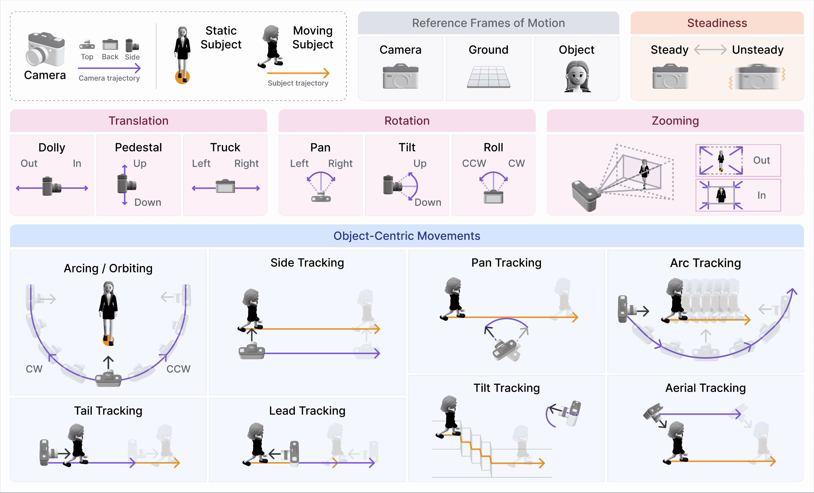

## 📷 **CameraBench: Towards Understanding Camera Motions in Any Video**  

### News
- **[2025/04/26]🔥** We release our **LoRA fine-tuned 7B model**, together with our **testset**, consisting of **over 1,000 videos with high quality labels and captions**.
- 32B and 72B Models are coming soon.

### 🌍Explore More
- [🤗**CameraBench Testset**](https://huggingface.co/datasets/syCen/CameraBench): Download the testset.
- [🚀**Lora Model**](): Download the Lora Finetuned 7B model.
- [🏠**Home Page**](https://linzhiqiu.github.io/papers/camerabench/): Project Home Page.
- [📖**Paper**](https://arxiv.org/abs/2504.15376): Detailed information about CameraBench.

## Taxonomy of Camera Motion Primitives


Here we demonstrate our taxonomy includes three reference frames (object-, ground-, and camera-centric) and defines key motion types, including translation (e.g., upward), rotation (e.g., roll clockwise), intrinsic changes (e.g., zoom-in), circular motion (e.g., arcing), steadiness (e.g., shaky), and tracking shots (e.g., side-tracking).


## CameraBench

We introduce CameraBench, a large-scale dataset with over 150K binary labels and captions over ~3,000 videos spanning diverse types, genres, POVs, capturing devices, and post-production effects (e.g., nature, films, games, 2D/3D, real/synthetic, GoPro, drone shot, etc.). We showcase example annotations below:


---

## SfMs vs. VLMs on CameraBench
We highlight the following key findings:

- Recent learning-based SfM/SLAM methods like [MegaSAM](https://arxiv.org/abs/2412.04463) and [CuT3R](https://cut3r.github.io/) achieve superior performance across most motion primitives, significantly outperforming classic methods like COLMAP. Nonetheless, SfMs are still far from solving this task. We show failure cases of SfM methods below:

  - *Left:* A `lead-tracking` shot where the camera moves backward as the subject walks forward. Due to unchanged subject framing and lack of distinct background textures, MegaSAM fails to detect camera translation and COLMAP crashes. 
  - *Right:* A `roll-clockwise` shot in a low-parallax scene where both MegaSAM and COLMAP fail to converge and output random trajectories with nonexistent motion.

- Although generative VLMs (evaluated using [VQAScore](https://linzhiqiu.github.io/papers/vqascore/)) are weaker than SfM/SLAM, they generally outperform discriminative VLMs that use CLIPScore/ITMScore. Furthermore, they are able to capture the **semantic primitives** that depend on scene content, while SfMs struggle to do so. Motivated by this, we apply supervised fine-tuning (SFT) to a generative VLM (Qwen2.5-VL) on a separately annotated training set of ~1400 videos. We show that simple SFT on small-scale (yet high-quality) data significantly boosts performance by 1-2x, making it match the SOTA MegaSAM in overall AP.


## VQA evaluation on VLMs

<table>
  <tr>
    <td>
    <div style="display: flex; flex-direction: column; gap: 1em;">
      
     </div>
    </td>
    <td>
      <div style="display: flex; flex-direction: column; gap: 1em;">
        <div>        
          <br>
          🤔: Does the camera track the subject from a side view? <br>
          🤖: ✅  &nbsp;&nbsp;&nbsp;&nbsp;&nbsp;&nbsp; 🙋: ✅
        </div>
        <div>
          <br>
          🤔: Does the camera only move down during the video? <br>
          🤖: ❌  &nbsp;&nbsp;&nbsp;&nbsp;&nbsp;&nbsp; 🙋: ✅
        </div>
        <div>
          <br>
          🤔: Does the camera move backward while zooming in? <br>
          🤖: ❌  &nbsp;&nbsp;&nbsp;&nbsp;&nbsp;&nbsp; 🙋: ✅
        </div>
      </div>
    </td>
  </tr>
</table>


## Citation

If you find this repository useful for your research, please use the following.
```
@article{lin2025towards,
  title={Towards Understanding Camera Motions in Any Video},
  author={Lin, Zhiqiu and Cen, Siyuan and Jiang, Daniel and Karhade, Jay and Wang, Hewei and Mitra, Chancharik and Ling, Tiffany and Huang, Yuhan and Liu, Sifan and Chen, Mingyu and Zawar, Rushikesh and Bai, Xue and Du, Yilun and Gan, Chuang and Ramanan, Deva},
  journal={arXiv preprint arXiv:2504.15376},
  year={2025},
}
```
