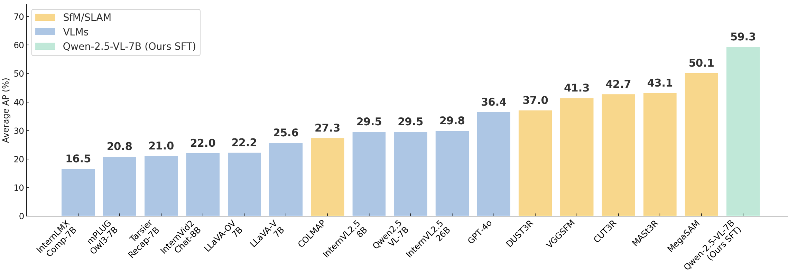
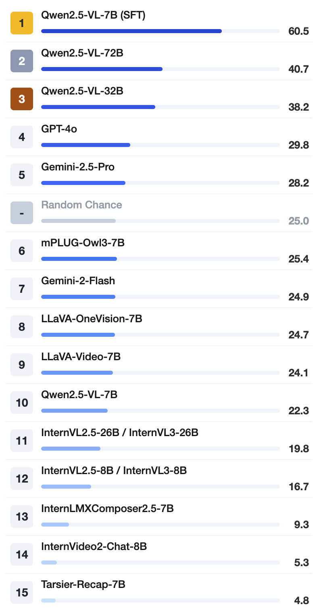
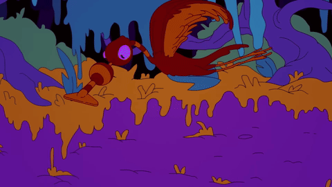

<p align="center">
  
</p>

## 📷 **CameraBench: Towards Understanding Camera Motions in Any Video**  

[](https://arxiv.org/abs/2504.15376)
[](https://linzhiqiu.github.io/papers/camerabench/)
[](https://huggingface.co/datasets/syCen/CameraBench)


> **SfMs and VLMs performance on CameraBench**: Generative VLMs (evaluated with [VQAScore](https://linzhiqiu.github.io/papers/vqascore/)) trail classical SfM/SLAM in pure geometry, yet they outperform discriminative VLMs that rely on CLIPScore/ITMScore and—even better—capture scene‑aware semantic cues missed by SfM.
> After simple supervised fine‑tuning (SFT) on ≈1 400 extra annotated clips, our 7B Qwen2.5‑VL doubles its AP, outperforming the current best MegaSAM.

## News
- **[2025/04/26]🔥** We open‑sourced our **fine‑tuned 7B model** and the public **test set**—1 000+ videos with expert labels & captions..
- **LLMs‑eval** integration is in progress—stay tuned!
- 32B & 72B checkpoints are on the way.

## 🌍Explore More
- [🤗**CameraBench Testset**](https://huggingface.co/datasets/syCen/CameraBench): Download the testset.
- [🚀**Fine-tuned Model**](): Access model checkpoints.
- [🏠**Home Page**](https://linzhiqiu.github.io/papers/camerabench/): Demos & docs.
- [📖**Paper**](https://arxiv.org/abs/2504.15376): Detailed information about CameraBench.
- [📈**Leaderboard**](https://sy77777en.github.io/CameraBench/leaderboard/table.html): Explore the full leaderboard..


## VQA evaluation on VLMs

<table>
  <tr>
    <td>
    <div style="display: flex; flex-direction: column; gap: 1em;">
      
     </div>
    </td>
    <td>
      <div style="display: flex; flex-direction: column; gap: 1em;">
        <div>        
          <br>
          🤔: Does the camera track the subject from a side view? <br>
          🤖: ✅  &nbsp;&nbsp;&nbsp;&nbsp;&nbsp;&nbsp; 🙋: ✅
        </div>
        <div>
          <br>
          🤔: Does the camera only move down during the video? <br>
          🤖: ❌  &nbsp;&nbsp;&nbsp;&nbsp;&nbsp;&nbsp; 🙋: ✅
        </div>
        <div>
          <br>
          🤔: Does the camera move backward while zooming in? <br>
          🤖: ❌  &nbsp;&nbsp;&nbsp;&nbsp;&nbsp;&nbsp; 🙋: ✅
        </div>
      </div>
    </td>
  </tr>
</table>

## 🚀 Quick Start

### Download test videos
```python
python download_test_videos.py --save_dir ./your_target_folder
```

### Get captions & labels (subset)
```python
python download_test_data.py --save_dir ./your_target_folder
```

### Download finetuned model
```python
# Coming soon – placeholder
```

## Citation

If you find this repository useful for your research, please use the following.
```
@article{lin2025towards,
  title={Towards Understanding Camera Motions in Any Video},
  author={Lin, Zhiqiu and Cen, Siyuan and Jiang, Daniel and Karhade, Jay and Wang, Hewei and Mitra, Chancharik and Ling, Tiffany and Huang, Yuhan and Liu, Sifan and Chen, Mingyu and Zawar, Rushikesh and Bai, Xue and Du, Yilun and Gan, Chuang and Ramanan, Deva},
  journal={arXiv preprint arXiv:2504.15376},
  year={2025},
}
```
